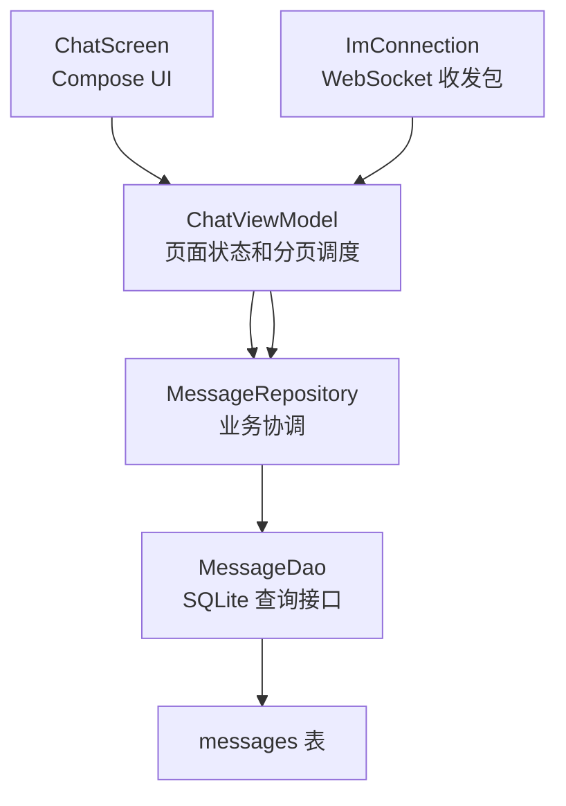

# B4 聊天历史分页设计笔记

本文记录当前 Android 自研 IM 客户端中“聊天历史分页”的设计原理，方便后续复习。当前实现只覆盖本地 SQLite 历史分页；服务端历史拉取仍预留在 `HISTORY_QUERY` / `HISTORY_RESULT` 协议命令上。

## 1. 数据模型

聊天记录不是 JSONL，也不是每个会话一张表。当前所有单聊消息共用 SQLite 的 `messages` 表：

```text
messages
------------------------------------------------------------
message_id | conversation_id | sender_id | receiver_id | ...
```

一条聊天消息对应 `messages` 表中的一行。一个会话的聊天记录，就是 `conversation_id` 相同的一组消息。

例如：

```text
message_id | conversation_id | sender_id | receiver_id | content
m1         | single:u1:u2    | u1        | u2          | hello
m2         | single:u1:u2    | u2        | u1          | hi
m3         | single:u1:u3    | u1        | u3          | hey
```

所以 `u1` 和 `u2` 的聊天记录不是一张独立表，而是：

```sql
WHERE conversation_id = 'single:u1:u2'
```

这种设计的好处是表结构稳定、索引简单，也方便统一做去重、ACK 更新、分页和会话聚合。

## 2. 游标分页

当前历史消息使用游标分页，不使用 `pageNo + offset`。

首次进入聊天页时读取最近 20 条：

```sql
SELECT *
FROM messages
WHERE conversation_id = ?
ORDER BY created_at DESC
LIMIT 20;
```

继续加载更早历史时，使用当前已加载消息中最早一条的 `createdAt` 作为 `beforeTime`：

```sql
SELECT *
FROM messages
WHERE conversation_id = ?
  AND created_at < ?
ORDER BY created_at DESC
LIMIT 20;
```

例如当前已加载：

```text
100, 99, 98 ... 81
```

下一页查询：

```text
created_at < 81
```

返回：

```text
80, 79, 78 ... 61
```

游标分页比 offset 分页更适合聊天记录，因为新消息可能随时插入最新端。使用 `beforeTime` 可以减少重复和漏页风险。

当前游标只使用 `createdAt`。如果以后需要处理同毫秒多消息的严格顺序，可以升级为复合游标：

```text
(createdAt, messageId)
```

## 3. 分层职责

当前实现保持既有分层：



各层职责：

- `ChatScreen`：只消费 `ChatUiState`，监听滚动位置，触发 `loadMoreHistory()`。
- `ChatViewModel`：维护当前聊天页状态、内存消息列表、分页 cursor、loading 状态和生命周期。
- `MessageRepository`：提供 `historyPage(userId, peerId, beforeTime, limit)`，协调 DAO 和业务逻辑。
- `MessageDao`：只暴露 SQLite 查询能力，不把 SQL 写进 ViewModel。
- `ImConnection`：只处理 WebSocket 连接、收包、发包、连接状态。

## 4. UI 展示顺序

当前 `MessageDao.queryPage()` 返回顺序是新到旧：

```text
最新消息 -> 更早消息
```

`ChatScreen` 使用：

```kotlin
LazyColumn(reverseLayout = true)
```

因此视觉上：

```text
上方：历史消息
下方：最新消息
```

ViewModel 内部继续保存新到旧的列表，这样最新消息永远在 `messages[0]`，旧消息逐步追加到列表末尾。

## 5. 自动加载更多

当前不需要用户点击“加载更多”。`ChatScreen` 监听 `LazyListState` 的可见 item 信息。

因为 `reverseLayout = true` 且 `messages` 是新到旧：

```text
index 0   最新消息
index 1
...
index 19  当前最早消息
```

当用户向上翻到旧消息端附近时，自动触发：

```kotlin
viewModel.loadMoreHistory()
```

当前阈值是 6 条，也就是每页 20 条的约 30%。当可见最大 index 接近列表尾部 6 条以内时，提前加载上一页。

触发条件抽在 `ChatAutoScrollPolicy.shouldLoadEarlierHistory()` 中：

- 当前有消息。
- `hasMoreLocal == true`。
- `isLoadingMore == false`。
- 当前内存消息数小于 2000。
- 可见区域已经接近旧消息端。

## 6. 内存缓存策略

当前采用“只增不删”的聊天页内存缓存。

意思是：在当前聊天页打开期间，已经加载到 `ChatUiState.messages` 的消息不会因为继续翻页而主动删除。

例如：

```text
首次进入：20 条
上滑一次：40 条
再上滑一次：60 条
```

这些消息会一直保留在当前 `ChatViewModel` 的 `messages` 中，直到用户退出这个聊天页。

这种策略的优点：

- 实现简单。
- 不容易造成滚动位置跳动。
- 用户刚看过的历史不需要重复查库。
- 实时新消息合并逻辑简单。

缺点：

- 如果用户连续翻非常久，内存中的消息列表会变大。

为避免极端情况，当前设置了保护上限：

```text
最多驻留 2000 条消息
```

达到上限后，自动历史加载停止，并通过 `isHistoryMemoryLimitReached` 给 UI 一个轻提示。SQLite 中的完整历史不会受影响。

## 7. 为什么暂不做滑动窗口

滑动窗口指只保留当前视口附近几页，例如最多缓存 5 页，超出后删除远离当前视口的页。

这个机制本身不是错误的，但当前阶段不优先做，原因是：

- 当前是文本消息，几百到两千条消息的内存成本可接受。
- 滑动窗口会引入滚动位置补偿问题。
- 删除窗口外消息后，用户反向滚动需要重新查询并恢复锚点。
- 实时新消息、历史分页和服务端历史 cursor 会更难协调。
- 当前 B4 目标是稳定实现聊天页历史分页，不是做极限长列表内存优化。

所以当前选择：

```text
SQLite 负责完整持久化
ChatViewModel 缓存本次打开聊天页期间用户看过的消息
内存最多保留 2000 条作为保护
```

## 8. 新消息自动滚到底

聊天页还需要满足 IM 常见体验：当当前聊天页收到新消息或自己发送新消息时，最新消息应出现在底部。

当前实现中，最新消息是 `messages.firstOrNull()`。当最新消息 id 变化时：

```kotlin
listState.animateScrollToItem(0)
```

因为 `LazyColumn(reverseLayout = true)`，滚到 index 0 就是滚到视觉底部。

这里也需要避免把“加载更早历史”误判成新消息。加载更早历史时，最新消息 id 不变，所以不会触发滚到底。

## 9. 生命周期和内存释放

`ChatViewModel` 不是全局共享的，它绑定当前聊天页。

在 `MainActivity` 中创建方式是：

```kotlin
remember(session.userId, peerId) {
    ChatViewModel(...)
}
```

进入 A-B 会话时创建一个对应的 `ChatViewModel`。返回会话列表时：

- `selectedPeerId = null`。
- `ChatScreen` 从 Compose UI 树移除。
- `DisposableEffect` 调用 `ChatViewModel.stop()`。
- `stop()` 取消聊天页收包协程并关闭当前 active conversation。

因此当前聊天页的 `ChatUiState.messages` 内存列表不再被聊天 UI 持有。SQLite 中的消息不会删除，下次进入会话会重新读取最近 20 条。

可以这样理解：

```text
全局共享：
MessageRepository / SQLite / WebSocket connection

聊天页临时持有：
ChatViewModel / ChatUiState.messages / 当前已加载的内存历史
```

## 10. 本地历史和服务端历史

当前 B4 只实现本地 SQLite 历史分页。离线时仍可查看本地已保存历史。

如果未来本地历史不够，需要继续向服务端请求历史，必须走已有自研协议命令：

```text
HISTORY_QUERY
HISTORY_RESULT
```

不要绕过自研协议去做普通 HTTP 历史接口。推荐后续入口仍放在 Repository 或同步层，不让 UI 直接接触协议或 DAO。

## 11. 当前关键参数

```text
每页条数：20
自动预加载阈值：6 条
内存驻留上限：2000 条
本地分页 cursor：beforeTime = 当前最早消息 createdAt
消息合并去重 key：messageId
显示方向：LazyColumn(reverseLayout = true)
```

